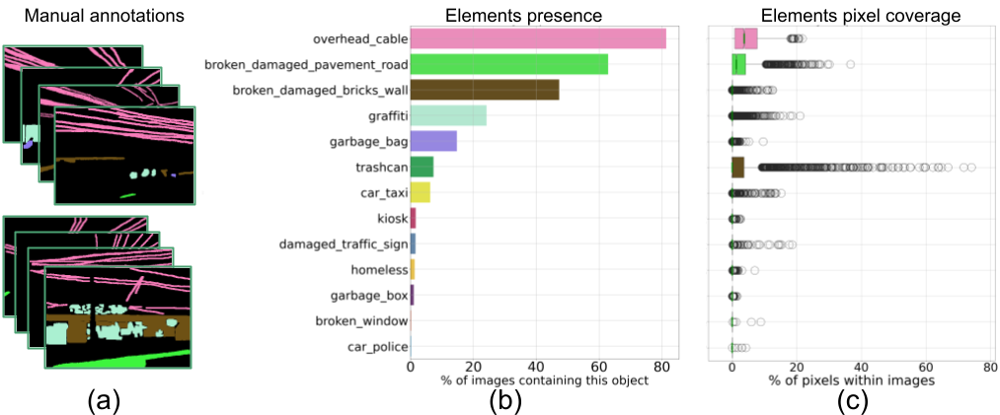

# Urban Physical Disorder (UrbanPD-4k) Dataset



This is the repository for the [UPD4K Dataset](https://visualdslab.com/papers/UrbanPD4k/). We provide some information of the dataset, and [starter code](./notebooks/) to explore the data. [Paper](http://fmorenovr.github.io/documents/papers/conferences/2025_BigData.pdf).

# Requirements

- **Python**>=3.12

## Overview
UPD4K is composed of more than 3.9K images from the Street view images. Images are fully annotated with objects, spanning over 163 object categories. Many of the images also contain physical disorder objects, such as overhead cables, garbage, etc. We also provide annotated masks and labels, as well as object instances for amodal segmentation. Images are also anonymized, blurring faces and license plates.

### Dataset stats
The current version of the dataset contains manual annotations of urban street physical disorder objects:

* 3.654 images manually segmented.  
* 13 new classes added (12 if we join garbages):  
    * Trashcan  
    * garbage box  
    * garbage bag  
    * broken/damaged pavement/road  
    * broken/damaged window  
    * broken/damaged/brick wall  
    * broken/damaged traffic sign  
    * homeless  
    * kiosk  
    * cat_taxi  
    * car_police  
    * graffiti  
    * overhead cable  

### Structure

Every annotations have:

* `ratios/`: CSV files containing the % of objetcs within images.  
* `masks/`: pickle files containing pixel classes.  
* `segmented_images/`: containing `.png` images of classes.  
* `segmented_images_overlay/`: containing `.png` images of classes.  

### Download
To download the dataset, use [this link](https://drive.google.com/drive/folders/1lIgpeg4B0r35Q1R3joMph3yKYfbWXpbF?usp=drive_link). Or send an e-mail asking for data.

To download Street view images, please do not hesitate to send a message.  

## Data Preparation

* Download images.  
* Create a `.env` file, and add the path of the data downloaded and models.  
  ```
    DATA_PATH=/path_to/datasets/
    MODEL_PATH=/path_to/models/
  ```
* First, run the notebook `notebooks/Data/ADE20k/Scene_Segmentations.ipynb`.  
  Choose the best model to segment images.  
  Next, run the notebook `notebooks/Data/ADE20k/Generate_Segmentations.ipynb`.  
  Then, run the notebook `notebooks/Data/ADE20k/Group_Segmentations.ipynb`.  

* Second, run the notebook `notebooks/Data/UPD4k/Generate_UPD4k.ipynb`.  
  Next, run the notebook `notebooks/Data/UPD4k/Group_UPD4k.ipynb`.  
  
* Train the safety classifier at `notebooks/Models/Ensemble_Classifications.ipynb`.  

* Generates Post-Hoc SHAP Explanations at `notebooks/Explanations/SHAP.ipynb`.  
* Generates CounterFactuals at `notebooks/Explanations/CounterFactuals.ipynb`.  

* Generates LLM human-language Interpretations at `notebooks/LLM/Interpretations.ipynb`.  


# Citation
If you use this data, please cite:

```
@inproceedings{moreno2025UrbanPD4k,
  author={Moreno-Vera, Felipe and De-la-Puente, Andres and Poco, Jorge},
  booktitle={2025 IEEE International Conference on Big Data (BigData)}, 
  title={UrbanPhysicalDisorder-4K: Understanding Urban Perception via Counterfactuals and Street View Signs of Physical Disorder}, 
  year={2025},
  pages={5194-5200},
  doi={10.1109/BigData66926.2025.11401786}
}
```

# Contact us  
For any issue please kindly email to `felipe [dot] moreno [at] fgv [dot] br`
